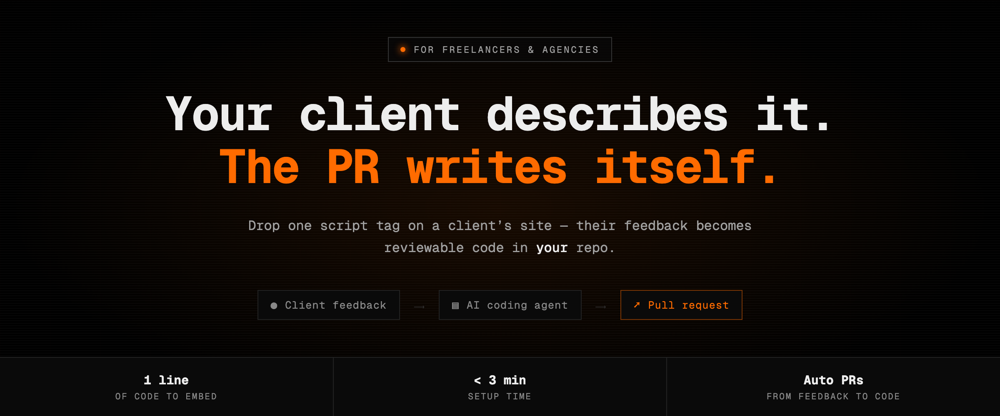

<p align="center">
  
</p>

<p align="center">
  
  
  
  
</p>

---

**Turn website feedback into production-ready pull requests.**

Embed a lightweight chat widget on a client's site to collect their input. Each
submission is handed to an AI coding agent that clones your repo, makes the
change, and opens a pull request for you to review.

Built for agencies and freelance developers who maintain sites for clients and
would rather review a diff than decode an email.

## How it works

```
┌──────────────┐     ┌────────────────┐     ┌──────────────┐     ┌─────────────┐
│ 1. Client    │ ──▶ │ 2. E2B sandbox │ ──▶ │ 3. OpenCode  │ ──▶ │ 4. Pull     │
│    submits   │     │    clones the  │     │    writes the│     │    request  │
│    feedback  │     │    repo        │     │    change    │     │    in your  │
│    in widget │     │                │     │  (MiniMax-M3)│     │    repo     │
└──────────────┘     └────────────────┘     └──────────────┘     └─────────────┘
```

1. **One script tag.** Drop the embed snippet on any client site — no framework, no build step.
2. **Isolated execution.** Feedback schedules an [E2B](https://e2b.dev) sandbox (2 vCPU, 2 GiB) that clones the target repo.
3. **The agent works.** [OpenCode](https://opencode.ai) running **MiniMax-M3** implements the request inside the VM.
4. **You review.** A branch is pushed and a PR opened by your GitHub App bot. Nothing merges itself.

## Stack

| Layer | Choice |
|---|---|
| Framework | Next.js 16 (App Router), React 19, TypeScript (strict) |
| Styling | Tailwind CSS 4, Geist Mono, dark terminal aesthetic |
| Auth | NextAuth (GitHub OAuth) + GitHub App installation |
| Database | PostgreSQL via Prisma |
| Agent runtime | E2B sandboxes + OpenCode + MiniMax-M3 |
| Billing | Stripe (Free / Pro) |
| Email | Resend |
| Hosting | Vercel |

## Getting started

```bash
npm install
npm run dev
```

Then open [http://localhost:3000](http://localhost:3000) or your **TryCloudflare** tunnel URL.

Your local `.env.development` should point `NEXTAUTH_URL` and `NEXT_PUBLIC_APP_URL`
at that tunnel so GitHub OAuth matches. If the tunnel hostname changes, update
those two values plus `allowedDevOrigins` in `next.config.ts`.

## Environment

Copy [`.env.example`](./.env.example) to **gitignored** local files:

| File | When it loads |
|------|----------------|
| `.env.development` | `npm run dev` |
| `.env.production` | Local `npm run build` / scripts using production config |

> **Never commit real secrets.** Do not add `.env` or `.env.local` — Next would
> load them and override `.env.development` / `.env.production`.

**Vercel:** set the same keys under [Environment Variables](https://vercel.com/docs/projects/environment-variables)
(Production / Preview as needed). This repo does not ship `.env.production`.

**Prisma:** `npm run build` runs `prisma migrate deploy` (loads `.env.production`
locally; uses the host's `DATABASE_URL` on Vercel). For local migrations run
`npm run migrate:dev`.

**Local serverless-shaped env:** `prebuild` / `predev` runs
[`scripts/generate-server-env.mjs`](./scripts/generate-server-env.mjs), writing the
gitignored `lib/generated/server-env.ts`. If a local `.env.*` exists it injects into
`process.env`; otherwise it writes a stub and the host env is used as-is.

## Widget feedback automation

When feedback arrives, the app schedules an E2B sandbox that clones the repo, runs
OpenCode with MiniMax-M3, pushes a branch, and opens a PR.

GitHub auth stays **inside the sandbox**: the GitHub App credentials
(`GITHUB_APP_ID`, `GITHUB_APP_PRIVATE_KEY`) are written into the VM only long enough
to mint **installation tokens** — see
[`lib/feedback-agent/e2b/e2b-github.mjs`](./lib/feedback-agent/e2b/e2b-github.mjs).
The remote is scrubbed before OpenCode runs, so the agent never sees tokens. PRs are
authored by your GitHub App bot.

Required **server-only** variables:

- `E2B_API_KEY`
- `E2B_FEEDBACK_SANDBOX_TEMPLATE` (optional; defaults to `feedback2code-agent`)
- `MINIMAX_API_KEY`
- GitHub App credentials (`GITHUB_APP_ID`, `GITHUB_APP_PRIVATE_KEY`, plus the rest used by the dashboard install flow)

Users must complete the **GitHub App install** so `githubInstallationId` is stored —
it selects which installation to mint tokens for.

### E2B sandbox template (once per team)

Sandboxes use a custom template `feedback2code-agent` (2 vCPU, 2048 MiB, Node 20,
OpenCode preinstalled) — see
[`e2b/feedback-agent/e2b.Dockerfile`](./e2b/feedback-agent/e2b.Dockerfile).

Publishing needs an **access token**, not just the API key:

```bash
cp .env.e2b.cli.example .env.e2b.cli   # add E2B_ACCESS_TOKEN
npm run e2b:build-feedback-template
```

Get the token from the [E2B API key docs](https://e2b.dev/docs/api-key), or run
`npx @e2b/cli auth login` interactively first. At runtime, hosts only need
`E2B_API_KEY` + `E2B_FEEDBACK_SANDBOX_TEMPLATE`.

### GitHub App URLs

Use the same origin as `NEXT_PUBLIC_APP_URL`:

| Setting | Value |
|---|---|
| Setup URL | `{origin}/api/github/setup` (GitHub appends `installation_id`) |
| Callback URL | `{origin}/api/github/callback`, or the setup URL directly |
| Webhook (optional) | `{origin}/api/github/webhook` — put the secret in `GITHUB_APP_WEBHOOK_SECRET` |

<details>
<summary><strong>Troubleshooting: push/PR fails with <code>403</code> or <code>Permission … denied to …[bot]</code></strong></summary>

The app is recognized but cannot write to that repo. In
[GitHub App settings](https://github.com/settings/apps) → your app → **Permissions**,
set **Repository permissions → Contents** and **Pull requests** to **Read and write**,
save, then reinstall the app (GitHub prompts to accept new permissions).

On the install screen choose **All repositories**, or ensure every repo you add in the
dashboard is checked. For organization repos, an org admin may need to approve the app
under **Organization settings → Third-party access**.

</details>

<details>
<summary><strong>Vercel / serverless timeouts</strong></summary>

`next/server`'s `after()` still runs under your function **max duration** (often
10–60s on Hobby/Pro). A full agent run can take many minutes. For production, host
where timeouts are long, or move `runE2bFeedbackAgent` behind a queue/worker
(Inngest, Trigger.dev, a small Railway service).

</details>

## Billing

Two plans, enforced on a rolling 30-day window:

| Plan | Feedback submissions |
|---|---|
| `FREE` | 10 / 30 days |
| `PRO` | 100 / 30 days |

Required server env: `STRIPE_SECRET_KEY`, `STRIPE_PRO_PRICE_ID`, `STRIPE_WEBHOOK_SECRET`.

Create products and prices, then copy the printed `price_...` into `STRIPE_PRO_PRICE_ID`:

```bash
npm run billing:setup-stripe
```

Webhook endpoint is `POST /api/stripe/webhook`. Locally:

```bash
stripe listen --forward-to localhost:3000/api/stripe/webhook
```

<details>
<summary><strong>Stripe Dashboard checklist</strong></summary>

1. **One webhook only.** Two destinations on the same URL make Stripe deliver every event **twice**. Keep a single endpoint for `/api/stripe/webhook`.
2. **Events to send** (these four are enough):
   - `checkout.session.completed`
   - `customer.subscription.created`
   - `customer.subscription.updated`
   - `customer.subscription.deleted`
3. **Signing secret.** Each endpoint has its own `whsec_...`. Use the one for the endpoint you keep — deleting and recreating an endpoint changes it.
4. **Customer portal.** Required for "Manage billing": enable it in [test mode](https://dashboard.stripe.com/test/settings/billing/portal) and [live mode](https://dashboard.stripe.com/settings/billing/portal).
5. **Production webhook URL.** `https://feedback2code.dev/api/stripe/webhook`, using the live endpoint's signing secret.

Use **test** keys in `.env.development` and **live** keys in Vercel Production. Until
live keys are set, production checkout and webhooks will not work.

</details>

## Deploy

Hosted on Vercel — see the [Next.js deployment docs](https://nextjs.org/docs/app/building-your-application/deploying).
Production env comes from Vercel Environment Variables, and migrations run during
`npm run build` via `prisma migrate deploy`.

## License

**Proprietary — all rights reserved.** See [LICENSE](./LICENSE).

This source is published for reference and transparency only. It is **not** open
source: you may not copy, modify, deploy, redistribute, or reuse this code or any
part of it, and you may not use it to train AI models. For licensing enquiries,
get in touch via [feedback2code.dev](https://www.feedback2code.dev).
